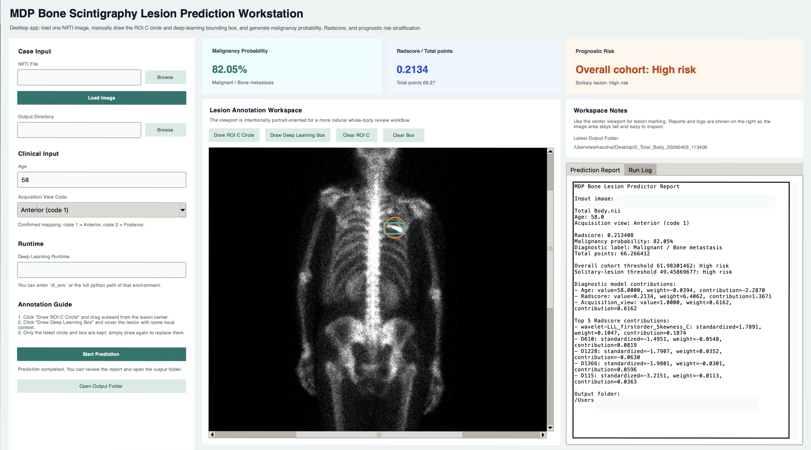

# MDP Bone Lesion Predictor

Desktop GUI for lesion-level prediction from MDP whole-body bone scintigraphy. The application lets a user load one NIfTI image, manually draw the radiomics ROI C and the deep-learning bounding box, and then generate diagnostic probability, Radscore, and prognostic risk output using the deployed version of your published model pipeline.

## Example Interface

The figure below shows an example workflow layout for the desktop workstation, including image review, manual annotation, and result reporting.



## Quick Start

### Windows

1. Download or clone this repository.
2. On Windows, double-click `Run-Windows.bat`.
3. Wait while the launcher:
   - finds or installs Python 3.10
   - creates one isolated local runtime inside `.runtime/app_env`
   - installs all required packages automatically
   - runs a health check
   - launches the GUI

No manual Conda setup is required.

### macOS

1. Download or clone this repository.
2. Double-click `launch_local.command`.
3. The launcher will:
   - reuse `.runtime/app_env` if it already exists
   - otherwise create the local runtime automatically
   - install packages
   - run a health check
   - launch the GUI

If Python 3.10+ is not installed yet, install it once and re-run `launch_local.command`.

### Manual setup

```bash
cd mdp-bm-predictor
python -m venv .venv
source .venv/bin/activate
pip install -r requirements/app.txt
python main.py
```

On Windows PowerShell, activate the environment with `.venv\Scripts\Activate.ps1`.

## Core Features

- Native `tkinter` desktop interface
- Portrait-oriented image viewport suitable for whole-body review
- Interactive grayscale window adjustment after loading a NIfTI image
- Manual ROI C circle drawing for radiomics extraction
- Manual bounding-box drawing for deep-learning extraction
- Automatic export of:
  - `rendered_canvas.png`
  - `annotation_preview.png`
  - `roi_c_mask.nii.gz`
  - `deep_features.json`
  - `prediction_summary.json`
  - `prediction_summary.txt`

The grayscale controls are intended to improve on-screen review and annotation visibility while keeping the original prediction pipeline unchanged.

## Model Summary

- Radiomics branch: the final 8 ROI C features from your paper
- Deep branch: ResNet101 pooled 2048-dimensional features, then the final 11 selected features
- Diagnostic model: `Age + Acquisition_view + Radscore`
- Prognostic output: `Total points` with two threshold-based calls
  - `overall_center1_youden`
  - `solitary_center1_youden`
- Confirmed acquisition-view mapping:
  - `1 = Anterior`
  - `2 = Posterior`

## Usage

1. Choose one `.nii` or `.nii.gz` image.
2. Click `Load Image`.
3. Adjust the grayscale level and width if you want a clearer lesion display for annotation.
4. Enter age.
5. Select `Anterior (code 1)` or `Posterior (code 2)`.
6. Draw `ROI C`.
7. Draw the deep-learning bounding box.
8. Click `Start Prediction`.
9. Review the prediction report and output folder.

## Repository Layout

```text
mdp-bm-predictor/
├── assets/
│   └── model_assets.json
├── docs/
│   └── readme_figure6.png
├── mdp_bm_predictor/
│   ├── __main__.py
│   ├── gui.py
│   ├── pipeline.py
│   ├── deep_worker.py
│   └── ...
├── requirements/
│   └── app.txt
├── scripts/
│   ├── bootstrap.py
│   ├── bootstrap_windows.ps1
│   └── healthcheck.py
├── PUBLISHING_NOTES.md
├── Run-Windows.bat
├── launch_local.command
├── main.py
└── pyproject.toml
```

## Windows Bootstrap Notes

- The first run may take several minutes because packages must be downloaded and installed.
- `torchvision` may also download the default ResNet101 weights on first deep-feature extraction.
- The bootstrapper assumes internet access is available.
- If Python is missing, the launcher tries:
  1. an existing `py` or `python` command
  2. `winget` installation of Python 3.10
  3. direct download of the official Python 3.10 installer

## Technical Notes

- The earlier ResNet50-labeled notebook does not match the final training matrix. This deployment uses the ResNet101 route that matches the actual training data.
- This repository is intended for research reproduction and internal validation.
- This project is not a certified medical device.

## Before Publishing Publicly

Please read [PUBLISHING_NOTES.md](PUBLISHING_NOTES.md) before pushing the repository to GitHub. In particular, verify de-identification and choose a license that matches how you want others to reuse the code.
